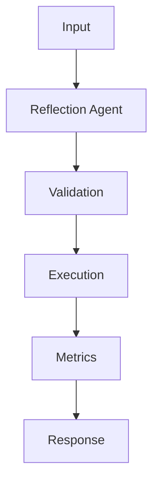

## Code

```python
from dataclasses import dataclass
from typing import Callable

@dataclass
class Tool:
    name: str
    description: str
    run: Callable[[str], str]

def route(task: str, tools: list[Tool]) -> str:
    lowered = task.lower()
    if "sql" in lowered or "database" in lowered:
        return "query_db"
    if "summarize" in lowered or "brief" in lowered:
        return "summarize"
    return "answer"

def execute(task: str, tools: list[Tool]) -> str:
    registry = {tool.name: tool for tool in tools}
    selected = route(task, tools)
    return registry[selected].run(task)

tools = [
    Tool("answer", "General response", lambda task: f"answer: {task}"),
    Tool("summarize", "Condense text", lambda task: task[:120]),
    Tool("query_db", "Run approved read-only SQL", lambda _: "SELECT count(*) FROM tickets;"),
]

print(execute("summarize the incident report", tools))
```

## Architecture



## References

- [langchain-ai.github.io](https://langchain-ai.github.io/langgraph/)
- [python.langchain.com](https://python.langchain.com/docs/concepts/tool_calling/)
- [platform.openai.com](https://platform.openai.com/docs/guides/function-calling)
