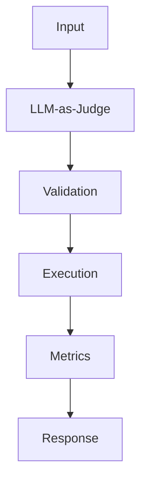

## Code

```python
from statistics import mean

examples = [
    {"answer": "The refund window is 30 days.", "context": "Refunds are available for 30 days."},
    {"answer": "Enterprise support is included.", "context": "Enterprise support requires a paid plan."},
]

def grounded_score(answer: str, context: str) -> float:
    answer_terms = {term.lower().strip(".,") for term in answer.split() if len(term) > 3}
    context_terms = {term.lower().strip(".,") for term in context.split()}
    return len(answer_terms & context_terms) / max(len(answer_terms), 1)

def evaluate(rows: list[dict[str, str]]) -> dict[str, float]:
    scores = [grounded_score(row["answer"], row["context"]) for row in rows]
    return {"mean_groundedness": round(mean(scores), 3)}

print(evaluate(examples))
```

## Architecture



## References

- [docs.ragas.io](https://docs.ragas.io/)
- [arxiv.org](https://arxiv.org/abs/2306.05685)
- [platform.openai.com](https://platform.openai.com/docs/guides/evals)
