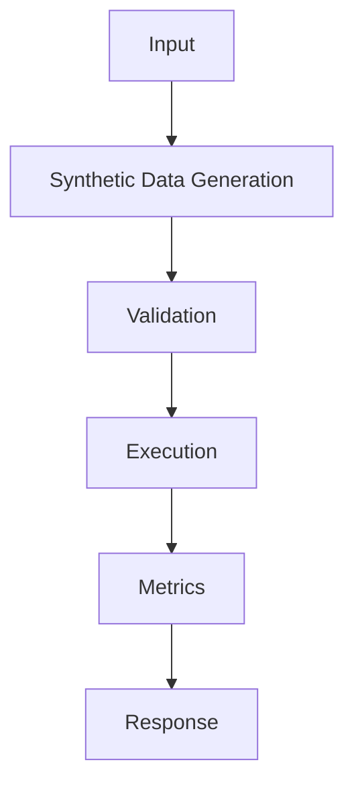

## Code

```python
import json
from pathlib import Path

raw_examples = [
    {"instruction": "Classify: chargeback after renewal", "output": "billing_dispute"},
    {"instruction": "Classify: cannot reset password", "output": "account_access"},
]

def to_chat_row(example: dict[str, str]) -> dict[str, list[dict[str, str]]]:
    return {
        "messages": [
            {"role": "system", "content": "Return one support intent label."},
            {"role": "user", "content": example["instruction"]},
            {"role": "assistant", "content": example["output"]},
        ]
    }

dataset = [to_chat_row(row) for row in raw_examples]
Path("train.jsonl").write_text("\n".join(json.dumps(row) for row in dataset))
print(f"wrote {len(dataset)} examples")
```

## Architecture



## References

- [arxiv.org](https://arxiv.org/abs/2106.09685)
- [huggingface.co](https://huggingface.co/docs/trl/sft_trainer)
- [huggingface.co](https://huggingface.co/docs/peft/index)
