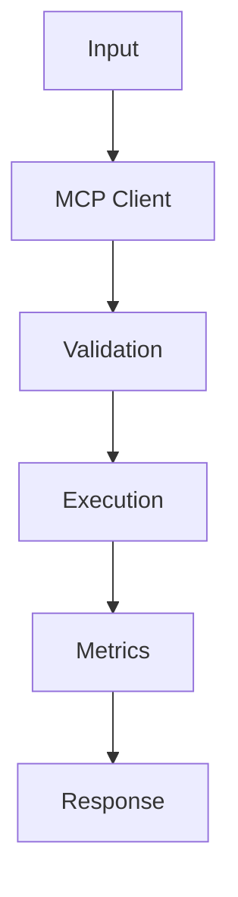

## Code

```python
from dataclasses import dataclass
from typing import Any, Callable

@dataclass
class ToolSpec:
    name: str
    description: str
    handler: Callable[[dict[str, Any]], dict[str, Any]]

class ToolRegistry:
    def __init__(self) -> None:
        self.tools: dict[str, ToolSpec] = {}

    def register(self, spec: ToolSpec) -> None:
        if spec.name in self.tools:
            raise ValueError(f"duplicate tool: {spec.name}")
        self.tools[spec.name] = spec

    def call(self, name: str, payload: dict[str, Any]) -> dict[str, Any]:
        return self.tools[name].handler(payload)

registry = ToolRegistry()
registry.register(ToolSpec("healthcheck", "Return service health", lambda _: {"ok": True}))
print(registry.call("healthcheck", {}))
```

## Architecture



## References

- [modelcontextprotocol.io](https://modelcontextprotocol.io/)
- [github.com](https://github.com/modelcontextprotocol/python-sdk)
- [github.com](https://github.com/modelcontextprotocol/typescript-sdk)
