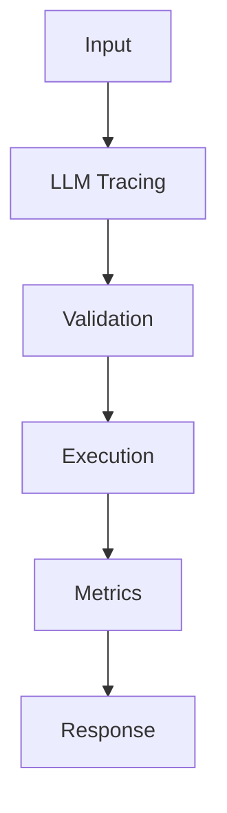

## Code

```python
import time
import uuid
from contextlib import contextmanager

@contextmanager
def llm_span(name: str, **attrs: object):
    trace_id = str(uuid.uuid4())
    started = time.perf_counter()
    try:
        yield trace_id
    finally:
        elapsed_ms = int((time.perf_counter() - started) * 1000)
        event = {"trace_id": trace_id, "name": name, "latency_ms": elapsed_ms, **attrs}
        print(event)

with llm_span("LLM Tracing", model="gpt-4o-mini", prompt_tokens=128):
    response = "Grounded answer with cited context."
print(response)
```

## Architecture



## References

- [opentelemetry.io](https://opentelemetry.io/docs/)
- [www.langchain.com](https://www.langchain.com/langsmith)
- [docs.smith.langchain.com](https://docs.smith.langchain.com/observability)
