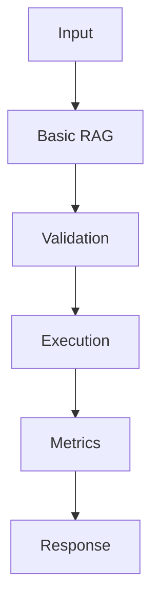

## Code

```python
import math
from collections import Counter

documents = {
    "runbook": "Restart the worker after rotating the OpenAI key.",
    "pricing": "Track token usage by model and request id.",
    "retrieval": "Hybrid search combines BM25 with vector similarity.",
}

def tokenize(text: str) -> list[str]:
    return [term.strip(".,").lower() for term in text.split()]

def score(query: str, text: str) -> float:
    query_terms = Counter(tokenize(query))
    doc_terms = Counter(tokenize(text))
    shared = set(query_terms) & set(doc_terms)
    numerator = sum(query_terms[term] * doc_terms[term] for term in shared)
    query_norm = math.sqrt(sum(value * value for value in query_terms.values()))
    doc_norm = math.sqrt(sum(value * value for value in doc_terms.values()))
    return numerator / (query_norm * doc_norm or 1)

def retrieve(query: str, k: int = 2) -> list[tuple[str, float]]:
    ranked = [(doc_id, round(score(query, text), 3)) for doc_id, text in documents.items()]
    return sorted(ranked, key=lambda row: row[1], reverse=True)[:k]

print(retrieve("hybrid search token usage"))
```

## Architecture



## References

- [docs.llamaindex.ai](https://docs.llamaindex.ai/en/stable/)
- [python.langchain.com](https://python.langchain.com/docs/concepts/retrievers/)
- [arxiv.org](https://arxiv.org/abs/2312.10997)
