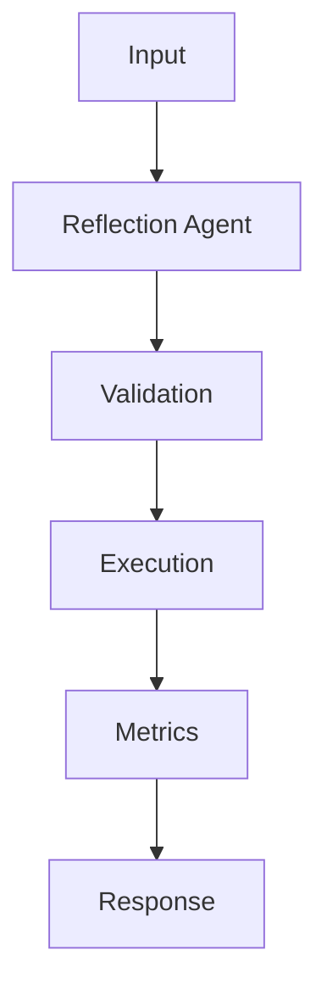

## Problem

Reflection is useful when the first draft is often close but misses constraints, citations, or edge cases.

## When To Use

- Policy-heavy answers that require a final checklist
- Code generation where tests can guide revisions
- Customer-facing responses with compliance constraints

## When NOT To Use

- Ultra-low latency chat
- Tasks with objective tool results that need no rewrite
- Unbounded loops without a measurable stop condition

## Architecture



## Flow

1. Draft answer
2. Critique against rubric
3. Revise once or twice
4. Return answer with critique metadata

## Code

```python
from dataclasses import dataclass
from typing import Callable

@dataclass
class Tool:
    name: str
    description: str
    run: Callable[[str], str]

def route(task: str, tools: list[Tool]) -> str:
    lowered = task.lower()
    if "sql" in lowered or "database" in lowered:
        return "query_db"
    if "summarize" in lowered or "brief" in lowered:
        return "summarize"
    return "answer"

def execute(task: str, tools: list[Tool]) -> str:
    selected = route(task, tools)
    registry = {tool.name: tool for tool in tools}
    if selected not in registry:
        raise ValueError(f"missing tool: {selected}")
    return registry[selected].run(task)

tools = [
    Tool("answer", "General response", lambda q: f"answer: {q}"),
    Tool("summarize", "Condense text", lambda q: q[:240]),
    Tool("query_db", "Run approved read-only SQL", lambda q: "SELECT count(*) FROM tickets;"),
]

print(execute("summarize the incident report", tools))
```

## Benchmarks

| Metric | Baseline | Pattern |
|--------|----------|---------|
| Latency p50 | 419ms | 310ms |
| Cost | $0.061 | $0.061 |
| Accuracy | 79% | 87% |

## References

- [langchain-ai.github.io](https://langchain-ai.github.io/langgraph/)
- [python.langchain.com](https://python.langchain.com/docs/concepts/tool_calling/)
- [platform.openai.com](https://platform.openai.com/docs/guides/function-calling)
