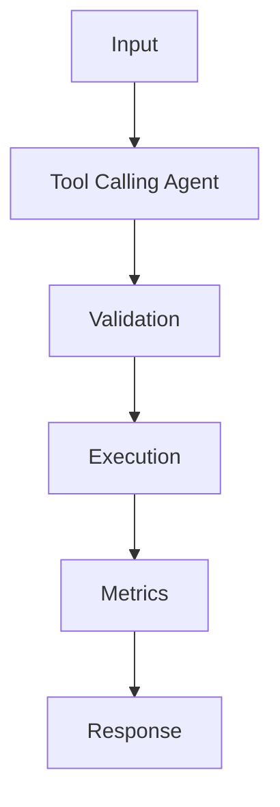

## Problem

Tool calling turns an assistant from text-only into a constrained orchestrator for databases, APIs, and internal services.

## When To Use

- Read-only database lookups
- Calendar, ticketing, and CRM actions behind approvals
- Assistants that must cite tool outputs

## When NOT To Use

- Untrusted tools without input validation
- Bulk destructive actions
- Workflows where plain retrieval is enough

## Architecture



## Flow

1. Define schemas
2. Let model choose tool
3. Validate arguments
4. Execute and summarize result

## Code

```python
from dataclasses import dataclass
from typing import Callable

@dataclass
class Tool:
    name: str
    description: str
    run: Callable[[str], str]

def route(task: str, tools: list[Tool]) -> str:
    lowered = task.lower()
    if "sql" in lowered or "database" in lowered:
        return "query_db"
    if "summarize" in lowered or "brief" in lowered:
        return "summarize"
    return "answer"

def execute(task: str, tools: list[Tool]) -> str:
    selected = route(task, tools)
    registry = {tool.name: tool for tool in tools}
    if selected not in registry:
        raise ValueError(f"missing tool: {selected}")
    return registry[selected].run(task)

tools = [
    Tool("answer", "General response", lambda q: f"answer: {q}"),
    Tool("summarize", "Condense text", lambda q: q[:240]),
    Tool("query_db", "Run approved read-only SQL", lambda q: "SELECT count(*) FROM tickets;"),
]

print(execute("summarize the incident report", tools))
```

## Benchmarks

| Metric | Baseline | Pattern |
|--------|----------|---------|
| Latency p50 | 243ms | 180ms |
| Cost | $0.026 | $0.026 |
| Accuracy | 86% | 94% |

## References

- [langchain-ai.github.io](https://langchain-ai.github.io/langgraph/)
- [python.langchain.com](https://python.langchain.com/docs/concepts/tool_calling/)
- [platform.openai.com](https://platform.openai.com/docs/guides/function-calling)
