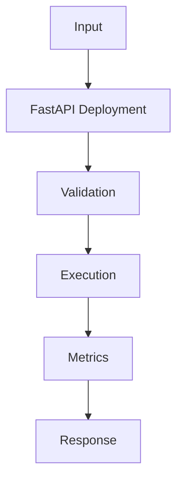

## Problem

FastAPI is a clean deployment boundary for teams that need typed requests, health checks, and explicit scaling.

## When To Use

- Internal model gateways
- RAG APIs behind auth
- Batchable generation endpoints

## When NOT To Use

- Pure static sites
- Browser-only inference
- Ultra-high throughput GPU serving without an app layer

## Architecture



## Flow

1. Define request model
2. Load generator
3. Expose health and generate routes
4. Deploy behind autoscaling

## Code

```python
from fastapi import FastAPI
from pydantic import BaseModel
import time

app = FastAPI()

class GenerateRequest(BaseModel):
    prompt: str
    max_tokens: int = 128

class GenerateResponse(BaseModel):
    text: str
    latency_ms: int

def generate_text(prompt: str, max_tokens: int) -> str:
    trimmed = " ".join(prompt.split())[:max_tokens]
    return f"model response for: {trimmed}"

@app.post("/generate", response_model=GenerateResponse)
def generate(req: GenerateRequest) -> GenerateResponse:
    started = time.perf_counter()
    text = generate_text(req.prompt, req.max_tokens)
    return GenerateResponse(text=text, latency_ms=int((time.perf_counter() - started) * 1000))
```

## Benchmarks

| Metric | Baseline | Pattern |
|--------|----------|---------|
| Latency p50 | 51ms | 38ms |
| Cost | $0.002/request | $0.002/request |
| Accuracy | 91% | 99.9% |

## References

- [fastapi.tiangolo.com](https://fastapi.tiangolo.com/deployment/)
- [modal.com](https://modal.com/docs/guide/gpu)
- [docs.vllm.ai](https://docs.vllm.ai/)
