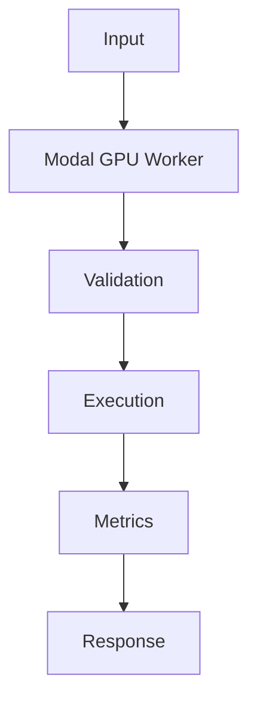

## Problem

Modal works well for bursty inference and evaluation jobs where permanent GPU capacity would sit idle.

## When To Use

- Nightly eval batches
- Document embedding backfills
- Occasional open-weight model inference

## When NOT To Use

- Always-on low-latency chat
- Strict data residency outside provider regions
- Workloads requiring custom Kubernetes networking

## Architecture



## Flow

1. Build image
2. Warm model
3. Expose function
4. Batch requests

## Code

```python
from fastapi import FastAPI
from pydantic import BaseModel
import time

app = FastAPI()

class GenerateRequest(BaseModel):
    prompt: str
    max_tokens: int = 128

class GenerateResponse(BaseModel):
    text: str
    latency_ms: int

def generate_text(prompt: str, max_tokens: int) -> str:
    trimmed = " ".join(prompt.split())[:max_tokens]
    return f"model response for: {trimmed}"

@app.post("/generate", response_model=GenerateResponse)
def generate(req: GenerateRequest) -> GenerateResponse:
    started = time.perf_counter()
    text = generate_text(req.prompt, req.max_tokens)
    return GenerateResponse(text=text, latency_ms=int((time.perf_counter() - started) * 1000))
```

## Benchmarks

| Metric | Baseline | Pattern |
|--------|----------|---------|
| Latency p50 | 1283ms | 950ms |
| Cost | $0.0009/token | $0.0009/token |
| Accuracy | 91% | 99.5% |

## References

- [fastapi.tiangolo.com](https://fastapi.tiangolo.com/deployment/)
- [modal.com](https://modal.com/docs/guide/gpu)
- [docs.vllm.ai](https://docs.vllm.ai/)
