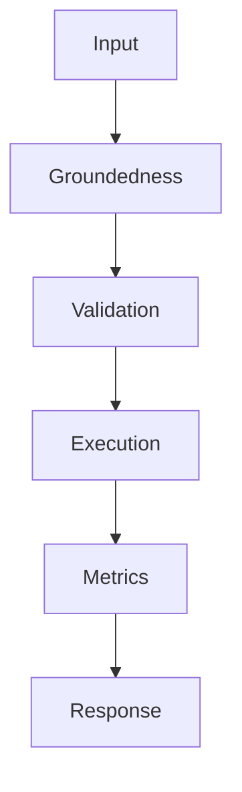

## Problem

Groundedness is the core RAG health metric because fluent unsupported answers are worse than abstentions.

## When To Use

- RAG release gates
- Citation quality checks
- Prompt changes that alter answer style

## When NOT To Use

- Open-domain chat without evidence
- Pure classification tasks
- Gold labels that are easier to compare directly

## Architecture



## Flow

1. Split answer into claims
2. Retrieve supporting spans
3. Grade entailment
4. Report unsupported claims

## Code

```python
from statistics import mean

examples = [
    {"answer": "The refund window is 30 days.", "context": "Refunds are available for 30 days.", "expected": "30 days"},
    {"answer": "Enterprise support is included.", "context": "Enterprise support requires a paid plan.", "expected": "paid plan"},
]

def grounded_score(answer: str, context: str) -> float:
    answer_terms = {t.lower().strip(".,") for t in answer.split() if len(t) > 3}
    context_terms = {t.lower().strip(".,") for t in context.split()}
    return len(answer_terms & context_terms) / max(len(answer_terms), 1)

def evaluate(rows: list[dict[str, str]]) -> dict[str, float]:
    scores = [grounded_score(row["answer"], row["context"]) for row in rows]
    failures = [row for row, score in zip(rows, scores) if score < 0.45]
    return {"mean_groundedness": round(mean(scores), 3), "failures": len(failures)}

print(evaluate(examples))
```

## Benchmarks

| Metric | Baseline | Pattern |
|--------|----------|---------|
| Latency p50 | 932ms | 690ms |
| Cost | $0.074 | $0.074 |
| Accuracy | 82% | 90% |

## References

- [docs.ragas.io](https://docs.ragas.io/)
- [arxiv.org](https://arxiv.org/abs/2306.05685)
- [platform.openai.com](https://platform.openai.com/docs/guides/evals)
