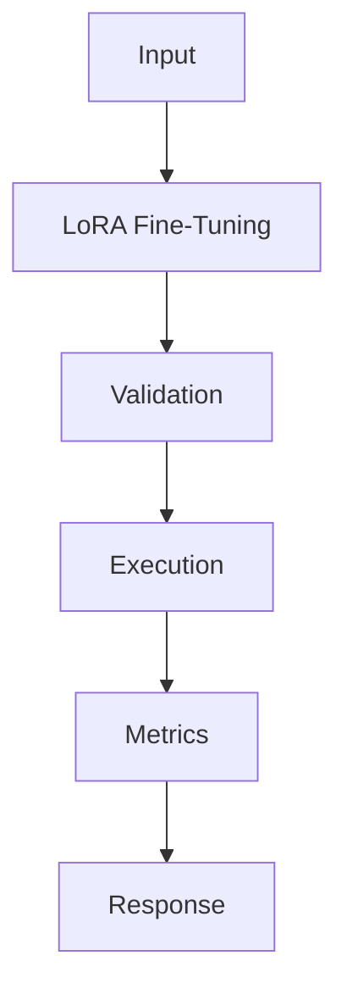

## Problem

LoRA is the practical route when you need task adaptation without owning a full training cluster.

## When To Use

- Intent classification with stable labels
- Domain style adaptation
- Private model adapters per customer

## When NOT To Use

- Knowledge injection that belongs in RAG
- Datasets below a few hundred high-quality examples
- Tasks that require larger base model capability

## Architecture



## Flow

1. Prepare JSONL
2. Train adapter
3. Evaluate held-out set
4. Serve merged or adapter model

## Code

```python
import json
from pathlib import Path

raw_examples = [
    {"instruction": "Classify: chargeback after renewal", "output": "billing_dispute"},
    {"instruction": "Classify: cannot reset password", "output": "account_access"},
]

def to_chatml(example: dict[str, str]) -> dict[str, list[dict[str, str]]]:
    return {
        "messages": [
            {"role": "system", "content": "Return one support intent label."},
            {"role": "user", "content": example["instruction"]},
            {"role": "assistant", "content": example["output"]},
        ]
    }

dataset = [to_chatml(row) for row in raw_examples]
Path("train.jsonl").write_text("\n".join(json.dumps(row) for row in dataset), encoding="utf-8")
print(dataset[0])
```

## Benchmarks

| Metric | Baseline | Pattern |
|--------|----------|---------|
| Latency p50 | 65ms | 48ms |
| Cost | $3.20/train | $3.20/train |
| Accuracy | 84% | 92% |

## References

- [arxiv.org](https://arxiv.org/abs/2106.09685)
- [huggingface.co](https://huggingface.co/docs/trl/sft_trainer)
- [huggingface.co](https://huggingface.co/docs/peft/index)
