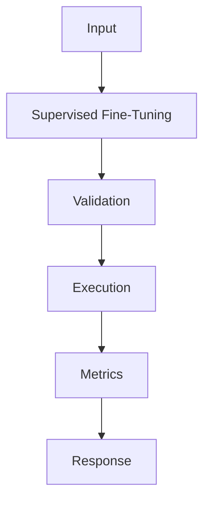

## Problem

SFT improves format control and repeated task behavior when prompting has reached its limit.

## When To Use

- Structured extraction with consistent schemas
- Support intent labeling
- Tone adaptation with reviewed examples

## When NOT To Use

- Frequently changing facts
- Unclear labels or noisy outputs
- Problems solvable with a better system prompt

## Architecture



## Flow

1. Collect reviewed examples
2. Normalize schema
3. Train model
4. Evaluate against prompt baseline

## Code

```python
import json
from pathlib import Path

raw_examples = [
    {"instruction": "Classify: chargeback after renewal", "output": "billing_dispute"},
    {"instruction": "Classify: cannot reset password", "output": "account_access"},
]

def to_chatml(example: dict[str, str]) -> dict[str, list[dict[str, str]]]:
    return {
        "messages": [
            {"role": "system", "content": "Return one support intent label."},
            {"role": "user", "content": example["instruction"]},
            {"role": "assistant", "content": example["output"]},
        ]
    }

dataset = [to_chatml(row) for row in raw_examples]
Path("train.jsonl").write_text("\n".join(json.dumps(row) for row in dataset), encoding="utf-8")
print(dataset[0])
```

## Benchmarks

| Metric | Baseline | Pattern |
|--------|----------|---------|
| Latency p50 | 84ms | 62ms |
| Cost | $4.80/train | $4.80/train |
| Accuracy | 85% | 93% |

## References

- [arxiv.org](https://arxiv.org/abs/2106.09685)
- [huggingface.co](https://huggingface.co/docs/trl/sft_trainer)
- [huggingface.co](https://huggingface.co/docs/peft/index)
