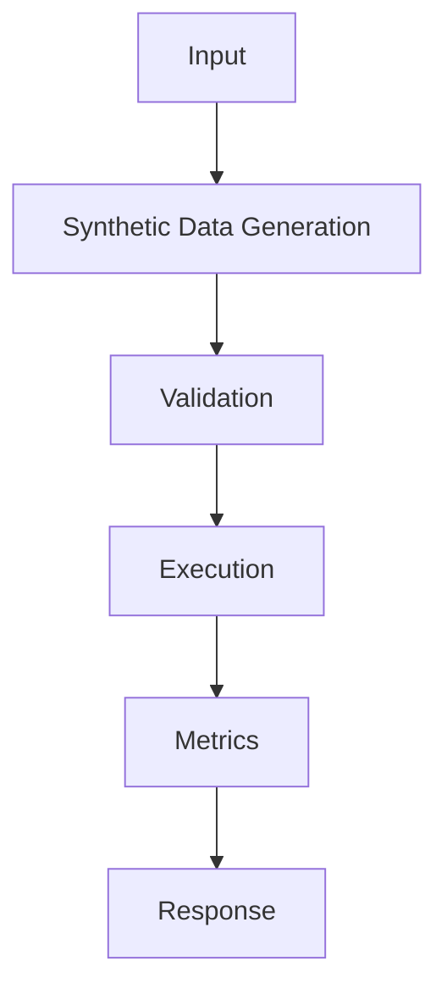

## Problem

Synthetic data is useful when real examples are sensitive, rare, or unevenly distributed.

## When To Use

- Cold-start classifiers
- Rare policy edge cases
- Expanding evaluation coverage before launch

## When NOT To Use

- Replacing all human-reviewed data
- Domains where generated labels are unverifiable
- Training on model errors without filtering

## Architecture



## Flow

1. Define schema
2. Generate diverse cases
3. Filter with validators
4. Mix with real data

## Code

```python
import json
from pathlib import Path

raw_examples = [
    {"instruction": "Classify: chargeback after renewal", "output": "billing_dispute"},
    {"instruction": "Classify: cannot reset password", "output": "account_access"},
]

def to_chatml(example: dict[str, str]) -> dict[str, list[dict[str, str]]]:
    return {
        "messages": [
            {"role": "system", "content": "Return one support intent label."},
            {"role": "user", "content": example["instruction"]},
            {"role": "assistant", "content": example["output"]},
        ]
    }

dataset = [to_chatml(row) for row in raw_examples]
Path("train.jsonl").write_text("\n".join(json.dumps(row) for row in dataset), encoding="utf-8")
print(dataset[0])
```

## Benchmarks

| Metric | Baseline | Pattern |
|--------|----------|---------|
| Latency p50 | 554ms | 410ms |
| Cost | $0.38/1k | $0.38/1k |
| Accuracy | 77% | 85% |

## References

- [arxiv.org](https://arxiv.org/abs/2106.09685)
- [huggingface.co](https://huggingface.co/docs/trl/sft_trainer)
- [huggingface.co](https://huggingface.co/docs/peft/index)
