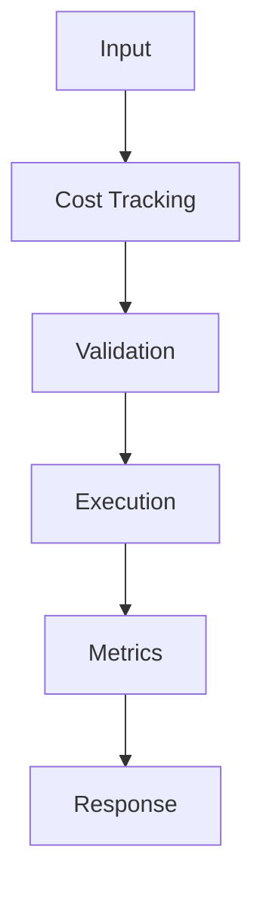

## Problem

Cost tracking turns model usage from a surprise bill into an operational metric.

## When To Use

- Multi-tenant SaaS assistants
- Prompt experiments across models
- Feature-level margin analysis

## When NOT To Use

- Offline experiments with fixed budgets
- Single-user prototypes
- Vendors that do not expose token usage

## Architecture



## Flow

1. Capture usage
2. Normalize prices
3. Attribute dimensions
4. Alert on anomalies

## Code

```python
import time
import uuid
from contextlib import contextmanager

@contextmanager
def llm_span(name: str, **attrs: object):
    trace_id = str(uuid.uuid4())
    started = time.perf_counter()
    print({"event": "start", "trace_id": trace_id, "name": name, **attrs})
    try:
        yield trace_id
    finally:
        elapsed_ms = int((time.perf_counter() - started) * 1000)
        print({"event": "end", "trace_id": trace_id, "latency_ms": elapsed_ms})

with llm_span("chat.completions", model="gpt-4o-mini", prompt_tokens=128):
    response = "Grounded answer with cited context."
print(response)
```

## Benchmarks

| Metric | Baseline | Pattern |
|--------|----------|---------|
| Latency p50 | 7ms | 5ms |
| Cost | $0.00005/call | $0.00005/call |
| Accuracy | 91% | 99.9% |

## References

- [opentelemetry.io](https://opentelemetry.io/docs/)
- [www.langchain.com](https://www.langchain.com/langsmith)
- [docs.smith.langchain.com](https://docs.smith.langchain.com/observability)
