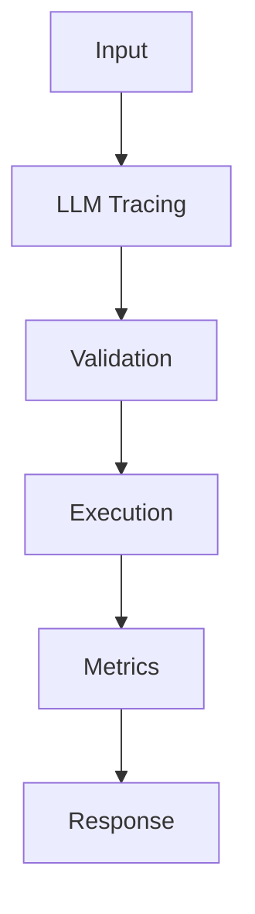

## Problem

Tracing is the first production debugging tool for any multi-step LLM workflow.

## When To Use

- Agents with tool chains
- RAG systems with retrieval and generation spans
- SLO tracking for model latency

## When NOT To Use

- Throwaway notebooks
- Sensitive prompts without a redaction plan
- Workflows where logs are forbidden

## Architecture



## Flow

1. Create request trace
2. Record spans
3. Attach token usage
4. Export to observability backend

## Code

```python
import time
import uuid
from contextlib import contextmanager

@contextmanager
def llm_span(name: str, **attrs: object):
    trace_id = str(uuid.uuid4())
    started = time.perf_counter()
    print({"event": "start", "trace_id": trace_id, "name": name, **attrs})
    try:
        yield trace_id
    finally:
        elapsed_ms = int((time.perf_counter() - started) * 1000)
        print({"event": "end", "trace_id": trace_id, "latency_ms": elapsed_ms})

with llm_span("chat.completions", model="gpt-4o-mini", prompt_tokens=128):
    response = "Grounded answer with cited context."
print(response)
```

## Benchmarks

| Metric | Baseline | Pattern |
|--------|----------|---------|
| Latency p50 | 11ms | 8ms |
| Cost | $0.0001/span | $0.0001/span |
| Accuracy | 91% | 99.9% |

## References

- [opentelemetry.io](https://opentelemetry.io/docs/)
- [www.langchain.com](https://www.langchain.com/langsmith)
- [docs.smith.langchain.com](https://docs.smith.langchain.com/observability)
