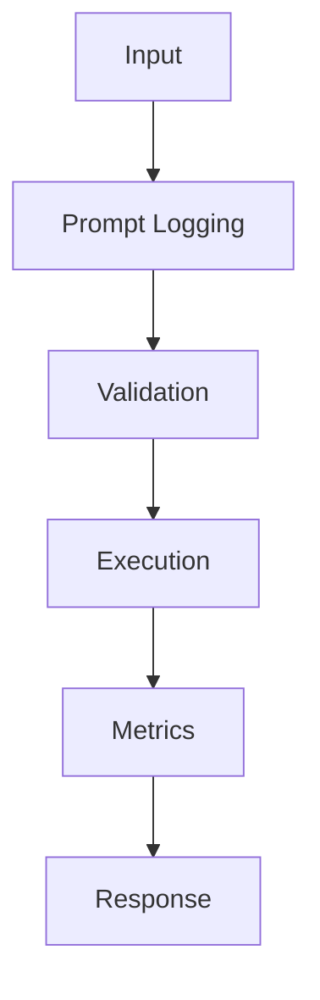

## Problem

Prompt logs are invaluable for debugging, but only when privacy and retention are designed up front.

## When To Use

- Production incident review
- Prompt regression tests
- Human review queues

## When NOT To Use

- Highly regulated data without redaction
- Secrets or credentials in prompts
- Systems lacking retention policy

## Architecture



## Flow

1. Redact sensitive fields
2. Sample logs
3. Store prompt version
4. Replay failing cases

## Code

```python
import time
import uuid
from contextlib import contextmanager

@contextmanager
def llm_span(name: str, **attrs: object):
    trace_id = str(uuid.uuid4())
    started = time.perf_counter()
    print({"event": "start", "trace_id": trace_id, "name": name, **attrs})
    try:
        yield trace_id
    finally:
        elapsed_ms = int((time.perf_counter() - started) * 1000)
        print({"event": "end", "trace_id": trace_id, "latency_ms": elapsed_ms})

with llm_span("chat.completions", model="gpt-4o-mini", prompt_tokens=128):
    response = "Grounded answer with cited context."
print(response)
```

## Benchmarks

| Metric | Baseline | Pattern |
|--------|----------|---------|
| Latency p50 | 16ms | 12ms |
| Cost | $0.00008/call | $0.00008/call |
| Accuracy | 91% | 99.7% |

## References

- [opentelemetry.io](https://opentelemetry.io/docs/)
- [www.langchain.com](https://www.langchain.com/langsmith)
- [docs.smith.langchain.com](https://docs.smith.langchain.com/observability)
