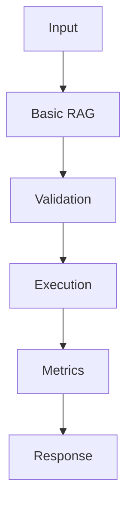

## Problem

Basic RAG is the default production starting point for private knowledge bases before adding re-rankers or hybrid indexes.

## When To Use

- Internal docs assistants under 50k chunks
- Support answer drafting with citations
- Runbooks that change faster than model training cycles

## When NOT To Use

- Questions requiring fresh transactional data
- Tiny static FAQ sets that fit in the prompt
- Corpora with heavy table reasoning needs

## Architecture



## Flow

1. Chunk documents
2. Embed chunks
3. Retrieve top-k
4. Generate with citations

## Code

```python
import math
from collections import Counter

documents = {
    "runbook": "Restart the worker after rotating the OpenAI key.",
    "pricing": "Track token usage by model and request id.",
    "retrieval": "Hybrid search combines BM25 with vector similarity.",
}

def tokenize(text: str) -> list[str]:
    return [t.strip(".,").lower() for t in text.split()]

def bm25_like(query: str, text: str) -> float:
    q = Counter(tokenize(query))
    d = Counter(tokenize(text))
    return sum(min(q[t], d[t]) for t in q)

def cosine_sparse(query: str, text: str) -> float:
    q = Counter(tokenize(query))
    d = Counter(tokenize(text))
    shared = set(q) & set(d)
    numerator = sum(q[t] * d[t] for t in shared)
    q_norm = math.sqrt(sum(v * v for v in q.values()))
    d_norm = math.sqrt(sum(v * v for v in d.values()))
    return numerator / (q_norm * d_norm or 1)

def retrieve(query: str, k: int = 2) -> list[tuple[str, float]]:
    scored = []
    for doc_id, text in documents.items():
        score = 0.65 * cosine_sparse(query, text) + 0.35 * bm25_like(query, text)
        scored.append((doc_id, round(score, 3)))
    return sorted(scored, key=lambda row: row[1], reverse=True)[:k]

print(retrieve("hybrid search token usage"))
```

## Benchmarks

| Metric | Baseline | Pattern |
|--------|----------|---------|
| Latency p50 | 162ms | 120ms |
| Cost | $0.022 | $0.022 |
| Accuracy | 74% | 82% |

## References

- [docs.llamaindex.ai](https://docs.llamaindex.ai/en/stable/)
- [python.langchain.com](https://python.langchain.com/docs/concepts/retrievers/)
- [arxiv.org](https://arxiv.org/abs/2312.10997)
